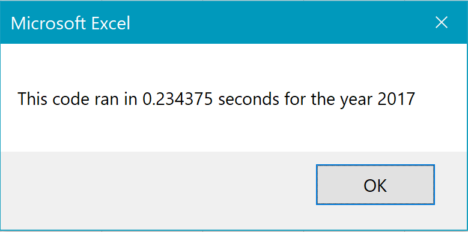
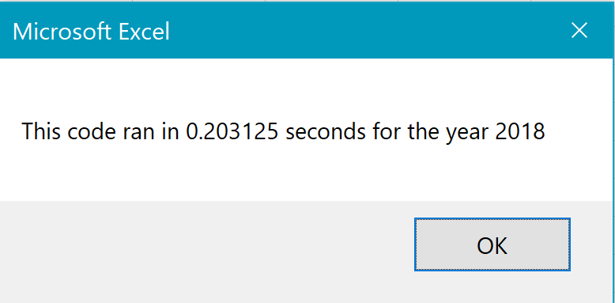

# stock-analysis

## Overview of Project

### Purpose
The purpose of this project was to refactor VBA code written to analyze stock market data from 2017 and 2018. The goal was to increase the efficiency of the code and reduce the run time of the macro.

## Results

The original code for the 2017 and 2018 analysis ran in 1.13 and 1.05 seconds, respectively. As shown below there was a gain in efficiency of approximately 80%. This was accomplished by adding a stock ticker index and three output arrays for stock volume, starting price, and ending price. The arrays reference the ticker index.

The code used within a loop to populate the arrays with values is also included below

        'Sum values for tickerVolume for first index/array
        If Cells(i, 1).Value = tickers(tickerIndex) Then
        tickerVolumes(tickerIndex) = tickerVolumes(tickerIndex) + Cells(i, 8).Value
        End If
        
        'Check if the current row is the first row with the selected tickerIndex, if yes set tickerStartingPrice.
       
        If Cells(i, 1).Value = tickers(tickerIndex) And Cells(i - 1, 1).Value <> tickers(tickerIndex) Then
            tickerStartingPrices(tickerIndex) = Cells(i, 6).Value
        End If
        
        'Check if the current row is the last row with the selected ticker, if yes set tickerEndingPrice. If yes, also increase tickerIndex by 1
        If Cells(i, 1).Value = tickers(tickerIndex) And Cells(i + 1, 1).Value <> tickers(tickerIndex) Then
        tickerEndingPrices(tickerIndex) = Cells(i, 6).Value
        End If
        If Cells(i, 1).Value = tickers(tickerIndex) And Cells(i + 1, 1).Value <> tickers(tickerIndex) Then
        tickerIndex = tickerIndex + 1
        End If

## Summary

### Pros and Cons of Refactoring Code
Refactoring code is typically positive because the refactored code will be better organized and hopefully more efficient. One of the cons is that while you are improving performance, you are not really adding any new functionality, so the improvement in performance needs to be worth the time taken to refactor the code.

### Applying Pros and Cons to This Project
While an 80% increase in performance is huge, in reality the time gained was less than one second. We really need to run the code using a larger data set in order to determine if the refactor was worth the effort. The code was also made more complicated, so could be harder for someone in the future to work with.
